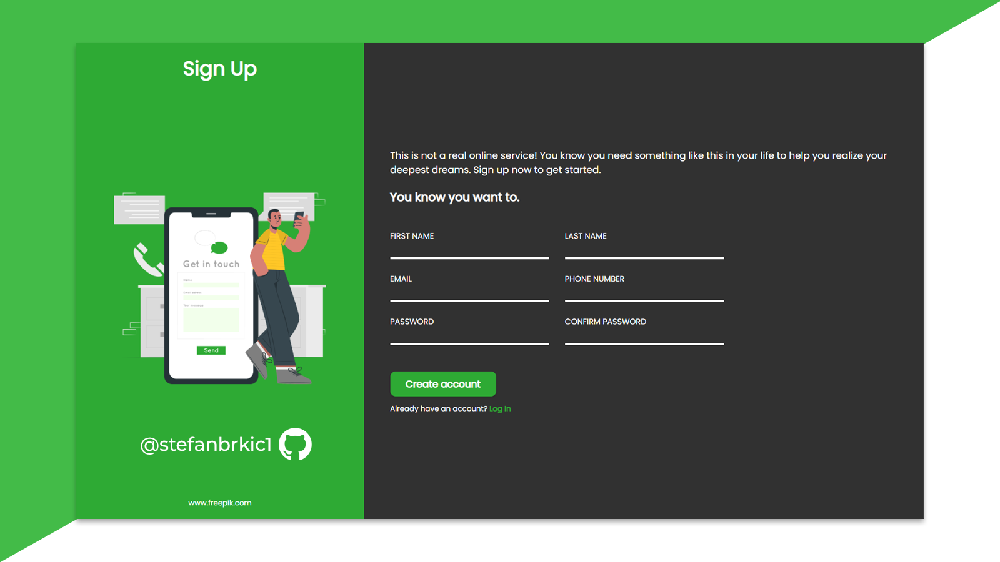
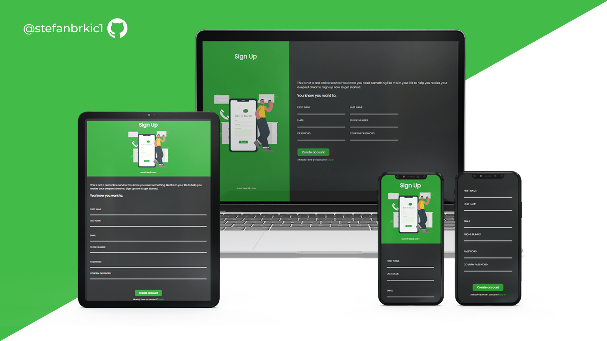

# SignUp-Form
A user-friendly signup form for effortless registration. Includes essential fields, CSS styles, and JavaScript functionality.

<!-- ABOUT THE PROJECT -->
## Preview

> **Note**  
>> Application is still under Development

 

## Built With

-    
-    
- 

 

## Tools Used

-     
-   
-   
-  
-     

 

## Features

- Built with **modern Javascript** practices
- It can **evaluate the form** effectively with conditions
- Comes with **optimized UI** & **UX**
- **Responsive** for both **Desktop** & **Mobile**

 